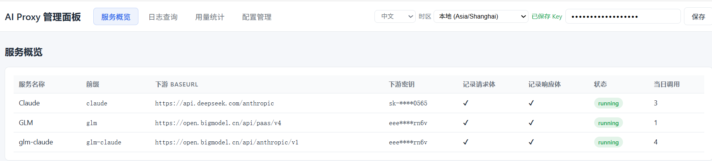
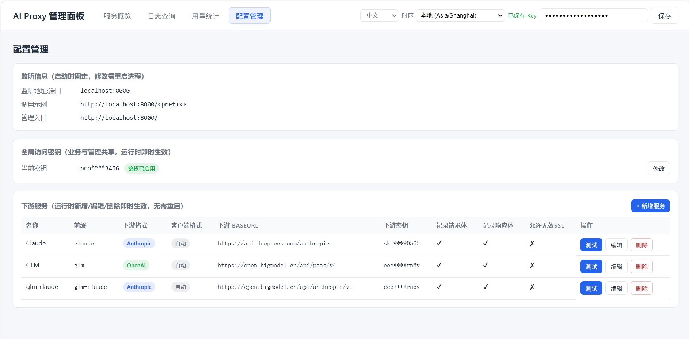
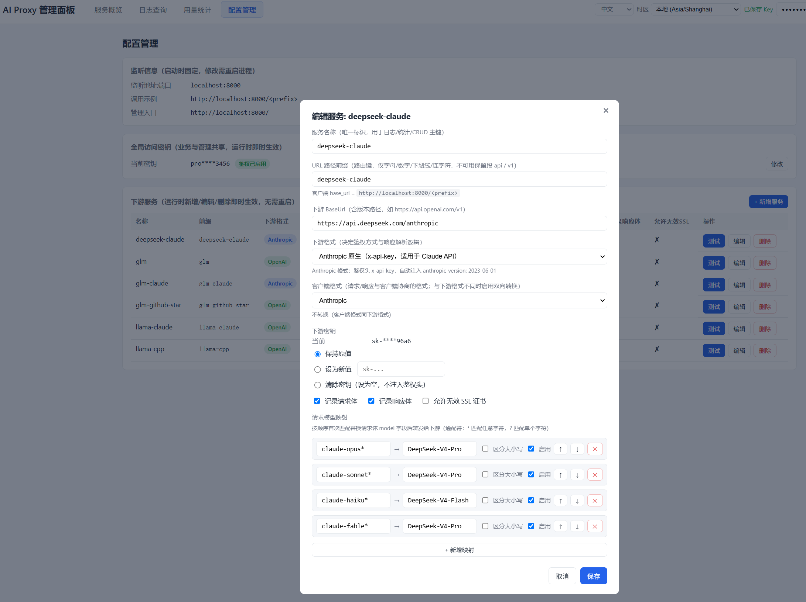
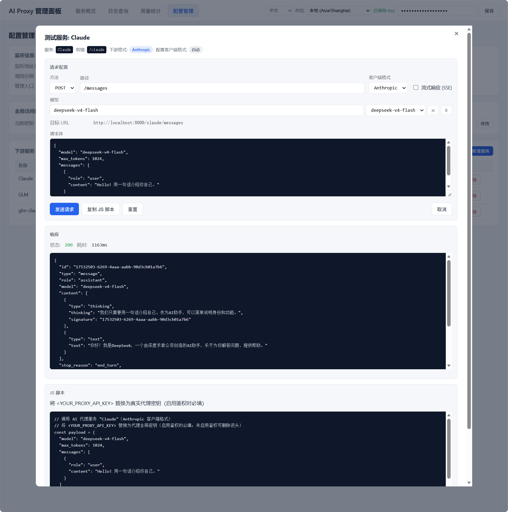
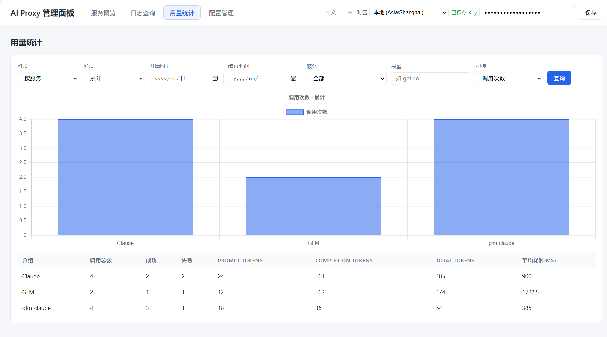
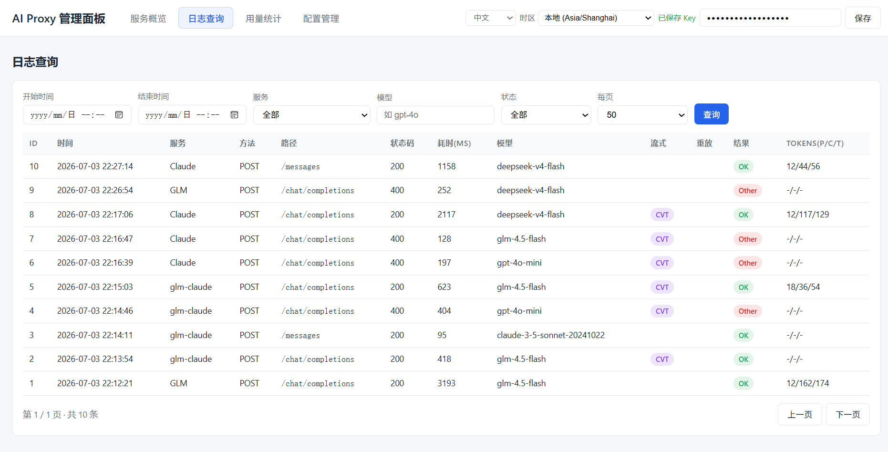
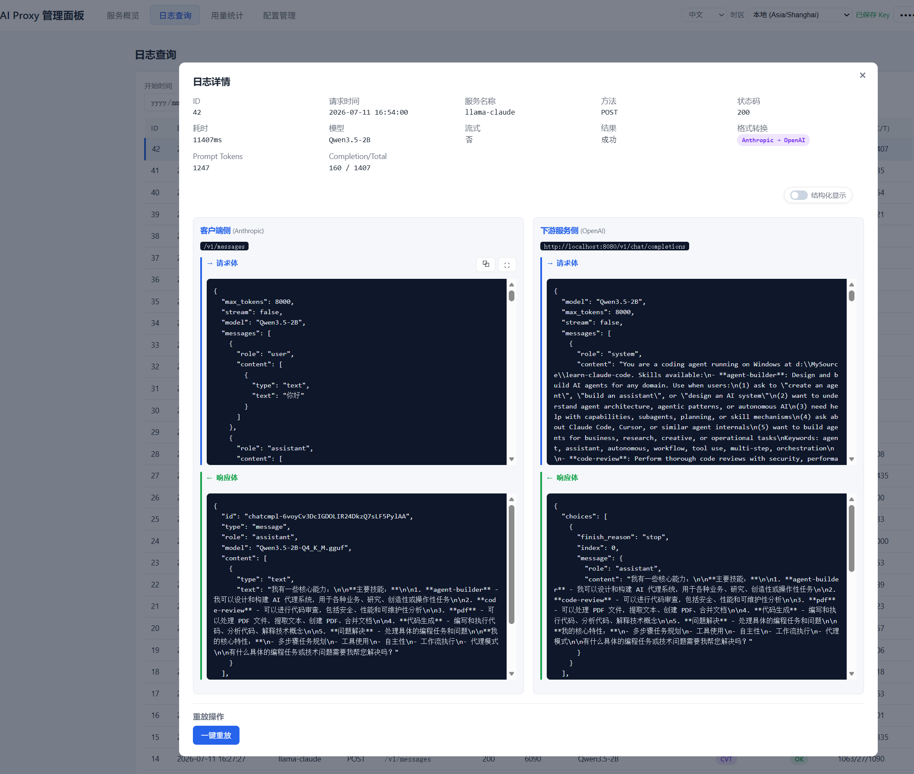
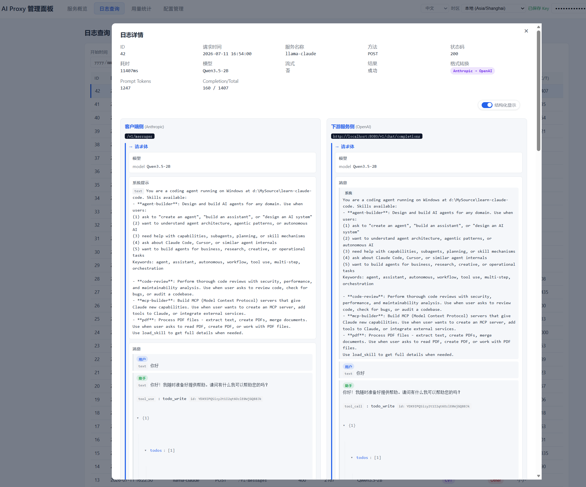

# AiProxy — Local AI Forwarding Proxy

[中文](README.md)

A lightweight local AI API forwarding service with single-port + URL path prefix routing, unified key management, full logging, and visual admin panel.

---

## Features

| Capability | Description |
|-----------|-------------|
| **URL Prefix Routing** | Routes by first path segment `/<prefix>/...` |
| **OpenAI/Anthropic Compatible** | Format conversion between OpenAI and Anthropic, low-latency streaming |
| **Request Model Mapping** | Rewrite the request body `model` field via wildcard patterns before forwarding downstream |
| **Unified Key Management** | Clients cannot access real upstream keys |
| **Full Logging** | SQLite-persisted request/response, token usage |
| **Web Admin Panel** | Service overview, log search, config, request replay |
| **Tab Persistence** | Restores the last active admin panel tab after refresh |
| **Hover-to-Copy Logs** | Hover over request/response body panels to reveal a copy button for one-click copy |
| **Request/Response Distinction** | Blue → / green ← color bars and icons visually distinguish request from response |
| **Hot Config Reload** | Admin panel edits take effect immediately, no restart needed |
| **Cross-platform Single File** | Windows / macOS / Linux |

---

## Quick Start

### Configuration

Edit `appsettings.json`:

```json
{
  "Proxy": {
    "GlobalApiKey": "proxy-local-123456",
    "ListenAddress": "localhost",
    "ListenPort": 8000
  }
}
```

| Key | Description | Runtime Editable |
|-----|-------------|:---:|
| `Proxy.GlobalApiKey` | Global proxy access key, empty disables auth | ✓ |
| `Proxy.ListenAddress` | Listen address (localhost / 0.0.0.0) | ✗ |
| `Proxy.ListenPort` | Listen port | ✗ |

### Run

```bash
cd AiProxy
dotnet run
```

Open `http://localhost:8000/` for the admin panel.


### Configure Downstream AI Services



### Test Request


### Usage Statistics


### Logs




---

## Request Model Mapping

Each downstream service can be configured with an ordered list of model mapping rules. At forwarding time, **after format conversion and before sending downstream**, the rules are applied in order to match and replace the `model` field in the request body. This is useful for redirecting a client-requested model name to the model actually available downstream.

### Configuration Example

Add `ModelMappings` to an element of the `AiServices` array in `appsettings.json`:

```json
{
  "Name": "openai-proxy",
  "PathPrefix": "openai",
  "BaseUrl": "https://api.openai.com",
  "ServiceFormat": "OpenAI",
  "ModelMappings": [
    {
      "Pattern": "gpt-4",
      "Replacement": "gpt-4-turbo",
      "Enabled": true
    },
    {
      "Pattern": "claude-3-opus*",
      "Replacement": "claude-3-5-sonnet",
      "Enabled": true
    }
  ]
}
```

| Field | Description |
|-------|-------------|
| `Pattern` | Wildcard pattern (`*` matches any characters, `?` matches a single character), matched against the request body `model` field |
| `Replacement` | Replacement value; on match, the model is replaced directly with this value |
| `Enabled` | Toggle to enable; `false` skips this rule |

### Matching Rules

- Rules are traversed in list order; only **enabled** mappings participate, and the **first match wins and stops** the traversal.
- On a match, the `model` is replaced with the `Replacement` value and written back to the request body.
- If nothing matches or the mapping list is empty, `model` is forwarded unchanged.
- Format conversion runs before mapping, so mappings also apply across format conversions (e.g. OpenAI client → Anthropic downstream).

### Wildcard Rules

- `*` matches any number of characters (including empty), `?` matches a single character, all other characters match literally.
- Patterns are always anchored to match the full string (no substring matching). For example, `gpt-4` only matches `gpt-4`, while `gpt-4*` matches `gpt-4`, `gpt-4o`, `gpt-4-turbo`.
- An empty `Pattern` is treated as valid but never participates in matching.

### Admin Panel Operations

The **Model Mapping** section is available in the *Config Management → Edit Service* modal:

- **Add / Delete**: the add button creates a new empty mapping; the ✕ button removes a single row.
- **Reorder**: ↑ / ↓ buttons adjust the order, which is the configuration order persisted to `appsettings.json`.
- **Enable toggle**: the checkbox on each row controls whether it participates in matching.

### Log Impact

The log `Model` field records the **model actually forwarded to downstream** (the `model` in the final request body after format conversion and model mapping), not the client's original model. Both the log list and detail views show this actual model.
